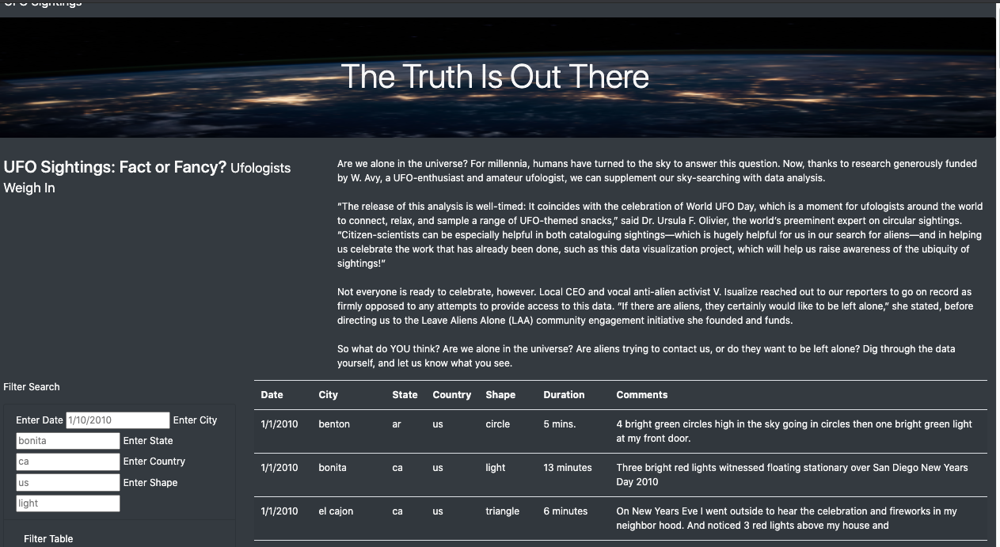
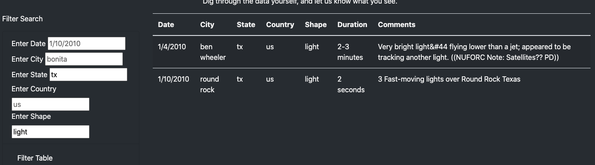

# UFOs

## Resources
    - Software Platform: Visual Studio Code 1.47.3, Google Chrome
    - Data Sources: data.js

### Challenge Overview
In this week's challenge, we were tasked with creating an interactive webpage that allowed readers to parse through UFO sighting data through multiple filters. Javascript and HTML was utilized to create this webpage and present it in a clean format. The webpage user is able to use any of the included filters (Date, City, State, Country, Shape) in order to filter through the dataset and learn more about the recorded UFO sightings. The image below shows an example for recorded sightings when filtering for "light" shape sightings in the state of Texas. Further development could be used to be able to search each data entry for a keyword or phrase in the comment column. 

### Website Screen Shot

### Filtered Data Example
